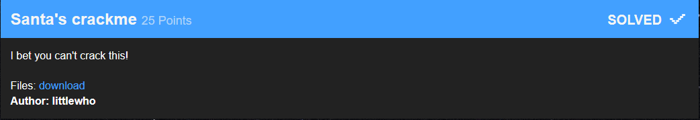
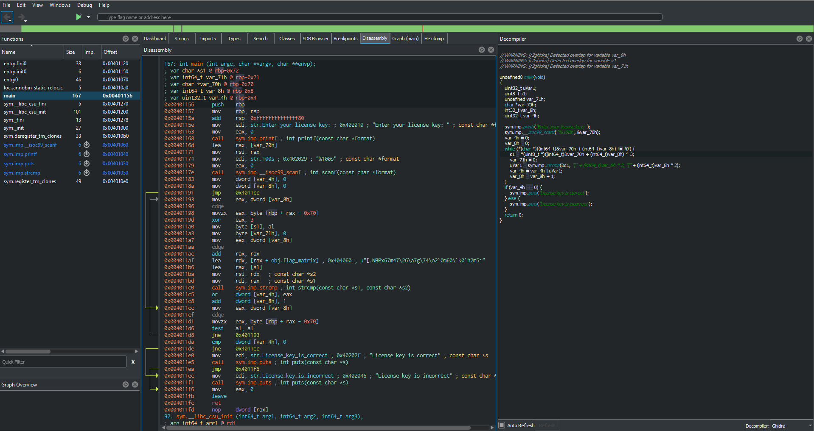
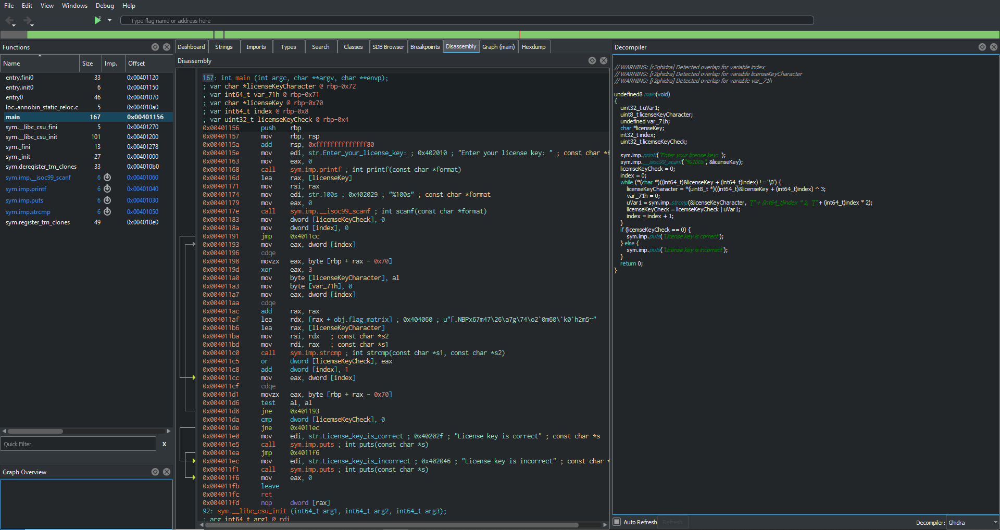
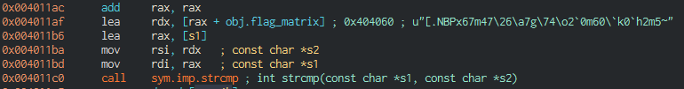
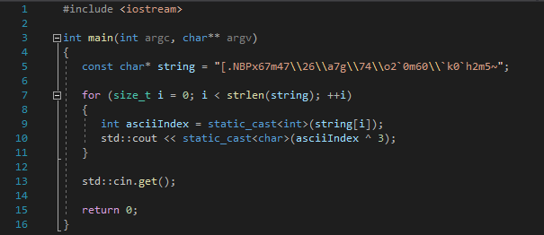
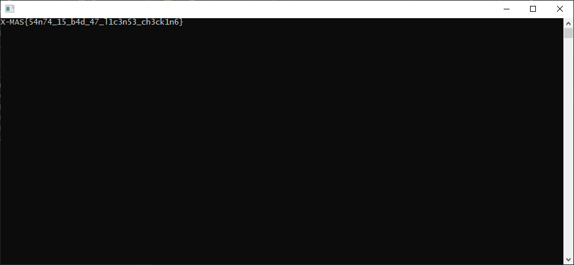

Tools used: [Cutter][1]


This task is basically serial/license key check.


When disassembled this is what we get



On address 0x0040117e we have call to scanf which get input from user.
And on the right part of Cutter we have code in more readable format.
Fist that we see is while loop. So we have input string and while loop, we also see that var_70h is holding our string that we provided.
So let's rename few variable for easier reading.
var_70h to licenseKey
var_4h licenseKeyCheck
var_8h to index




Now we can go thry code again.
while we are not at the end of licenseKey
get next character from licenseKey, do XOR 3 and store result in licenseKeyCharacter
then compare it with character from hard coded encrypted string
Note: as you can see on right generated code for that is

```C++
uVar1 = sym.imp.strcmp(&s1, "[" + (int64_t)var_8h * 2, "[" + (int64_t)var_8h * 2);
```

this is not entirely correct, that's why we always should look in generated code and in raw dissasembled code.
we can see what is really happening here



if strcmp returns 0 then characters are same
result of that comparation is OR-ed with licenseKeyCheck and stored in licenseKeyCheck
result is != 0 then licenseKeyCheck will not be 0, even if we got wrong one single character.

Logical approach?
Since XOR is easily reversable if you know number with was XOR-ed, we could take hard coded encrypted string and XOR it with 3
to decrypt string



When we run it we get flag




[1] https://cutter.re/